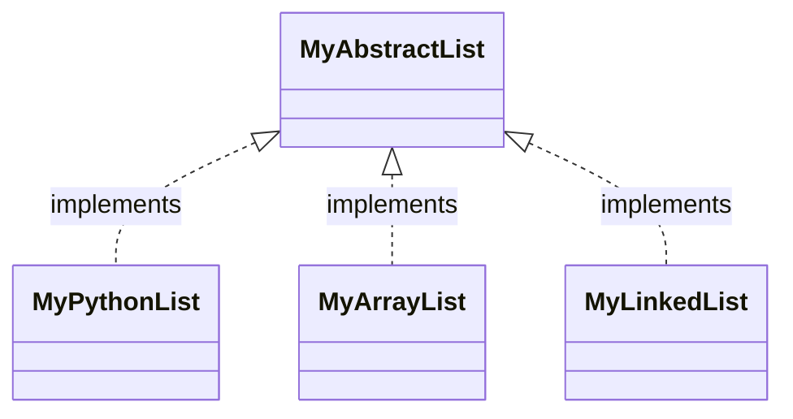
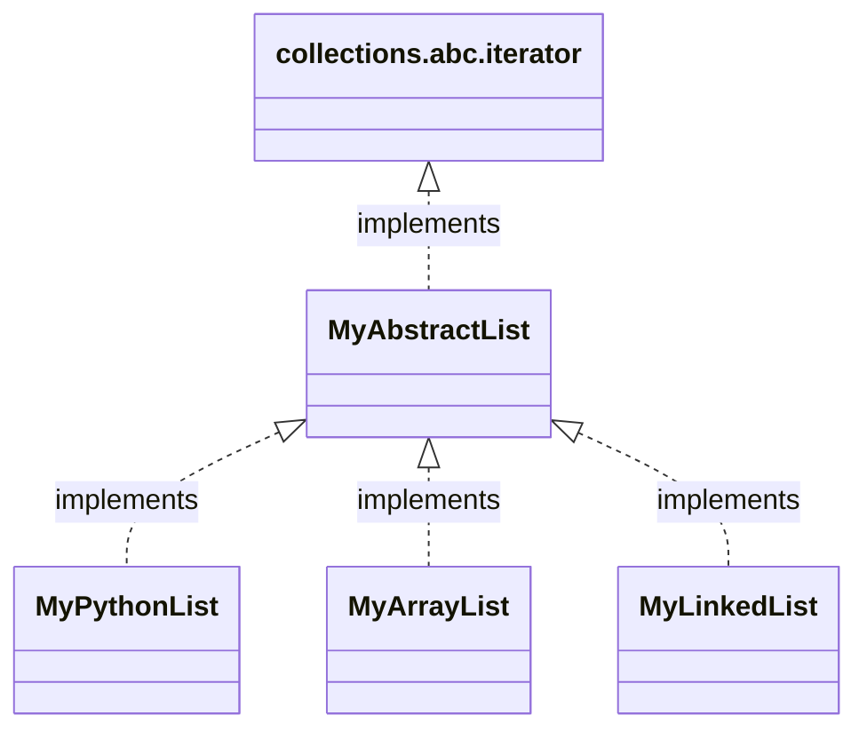

import CollapsibleAnswer from '@site/src/components/CollapsibleAnswer';
import DeepDive from '@site/src/components/DeepDive';
import ImageCard from '@site/src/components/ImageCard';
import ChatBaseBubble from "@site/src/components/ChatBaseBubble";

# Abstract Base Class

<ChatBaseBubble/>


### Goals

By the end of this lesson, you should be able to:
- Insert learning objective here

:::keyword Keywords
`abstract base class`, `iterable`
:::

There are cases when the _parent_ class only specifies what attributes and methods the child classes should have and in itself contain no implementation. You can think of this as something like the following definition:

```python
class MyAbstractClass:
    def add(self, other):
        pass

class ChildOfMyAbstractClass(MyAbstractClass):
    def add(self, other):
        # contains implementation of adding the two objects
        ...
```

In the first class of `MyAbstractClass`, there is a method `add(other)` which contains no definition. This method is overriden by the child class `ChildOfMyAbstractClass`. In this class, `add(other)` is defined and, thus, overridden.

Previously in `MixedFraction` class, we see how the child class' operations depends on the implementation of its parent class' methods. In that case, no `__add__()` nor `__sub__()` is defined in the child class. Therefore any method call to do addition and subtraction will be referred to the parent class implementation. The case of an Abstract class is the opposite of this. When we have an Abstract class with no implementation, we are forcing the implementation to be found in the child class. However, by writing the code as shown above, there is nothing that prevents the child class **not** to implement the required method.

Python provides some mechanism to ensure that the abstract method in the abstract base class is implemented in the child class. Let's take a look at one example of this using `collections.abc` class. This `collections.abc` class is an Abstract Base Class for containers. For example, if we want to create a new data type belonging to a type `Iterable`, we can inherit this new class from `collections.abc.Iterable`. Python will force the new class to define the method `__iter__()`. Otherwise, Python will throw an error. Let's try it out in the next cell.

<!-- ```python
import  collections.abc as c
class NotRightIterable(c.Iterable):
    def __init__(self):
        self.data = []
test = NotRightIterable()
```
The output is
```sh
---------------------------------------------------------------------------
TypeError                                 Traceback (most recent call last)
<ipython-input-3-04bbdf83346f> in <module>
      5         self.data = []
      6
      7 test = NotRightIterable() <---------
TypeError: Can't instantiate abstract class NotRightIterable with abstract methods __iter__
``` -->

<><iframe src="https://trinket.io/embed/python3/ab78c95e4f?start=result" width="100%" height="350" frameborder="0" marginwidth="0" marginheight="0" allowfullscreen></iframe></>

When you run the above cell, Python will complain saying that it cannot instantiate the new class because we did not implement the abstract method `__iter__()`. To fix this, we need to define this method in the child class.

<!-- ```python
import  collections.abc as c
class RightIterable(c.Iterable):
    def __init__(self):
        self.data = []

    def __iter__(self):
        return iter(self.data)
test = RightIterable()
``` -->

<><iframe src="https://trinket.io/embed/python3/80d189528e?start=result" width="100%" height="350" frameborder="0" marginwidth="0" marginheight="0" allowfullscreen></iframe></>

There will be no error when you run the above cell because now the method `__iter__()` has been implemented in the child class. The definition of `__iter__()` simply returns an iterable object from `self.data`.

So, we have shown the mechanism where Python ensures that when you create an Abstract Base Class with some abstract methods, the child class must implement this abstract method. Otherwise, Python will throw an exception. In future lessons, we will create our own Abstract Base Class.

## Abstract Base Class for Creating Abstract Data Types

We can apply this concept of Abstract Base Class to implement Abstract Data Type (ADT). ADT is a data type for objects whose behaviour is defined by some specific interface. The interface defines the operations that the data type can perform. However, ADT does not define how these operations are to be _implemented_. It is called _abstract_ because it is independent of its implementation.

As an example, we can create an Abstract Data Type (ADT) for a List object. In this list object, we can specify a set of operation as its interface. This operations specifies what List ADT can do. For example, here are some common List operations we can think of:

- a List object an _access_ an element in the list using its index.
- a List object can _modify_ an element in the list given its index.
- a List object can _append_ an element into the list.
- a List object can _remove_ an element given its index position.
- a List object can _check the number_ of elements in the list.

As mentioned previously, ADT does not specify how to implement these operations nor how to implement the data structure underlying it. ADT only specifies its interface by stating what are the operations that this data type should be able to do. Why is this important? The reason is that certain implementation may be better for specific scenario while other implementation maybe be better for other scenario.

Let's give some example to this. Let's imagine if our List ADT is implemented using Python's built-in list. We know from Python computational model that the following holds true for the complexity of the following operations.

- `append(item)` and `pop()` has complexity of $O(1)$.
- on the other hand, `insert(0, item)` has complexity of $O(n)$.

Imagine if our use case has more operations to insert at the beginning of the List. In this case, Python's built-in list may not be the best implementation. Another implementation like Linked List maybe better. We will discuss about Linked List in the next section. But for now, we see that different implementation may have different performance. However, the operations for List remain the same. Regardless of how it is implementated, we still want to insert the item or remove it.

Therefore, it is useful to define an Abstract Base Class that specifies the interface of an Abstract Data Type. In our case, we can define that a List must have some specific operations that it has to support such as appending, inserting and removing elements. The Abstract Base Class may not have the full implementation and yet it specifies that it request some of these _methods_ to be implemented in the child class.

We can then design an abstract base class for our List data as shown in the image below.
<br/>



<br/>

In this design, we have one abstract base class called `MyAbstractList` which defines the interface for our List ADT. This base class can be implemented in many ways. In your problem sets, you will implement this List ADT using a Fixed Size Array (`MyArrayList`) as well as using a Linked List (`MyLinkedList`). Details on the Fixed Size Array and Linked List is given in the next section. We gave you the implementation the List ADT using Python's built-in List (`MyPythonList`) in the problem set.

The great thing is that all these three different implementation has a common interface and a same set of methods. This way, you can switch your List implementation and the rest of the code still works fine because it follows the common interface of our `MyAbstractList` ADT. In this case, our abstract base class `MyAbstractList` enforces that the child class has to implement some specific methods. Extending this concept further, we can actually inherit `MyAbstractList` from `collections.abc.Iterator`. In this way, we enforce that our List ADT must have the `__iter__()` method. This allows our List ADT to be iterated over each of its elements. We can draw the final UML diagram in this way.
<br/>


