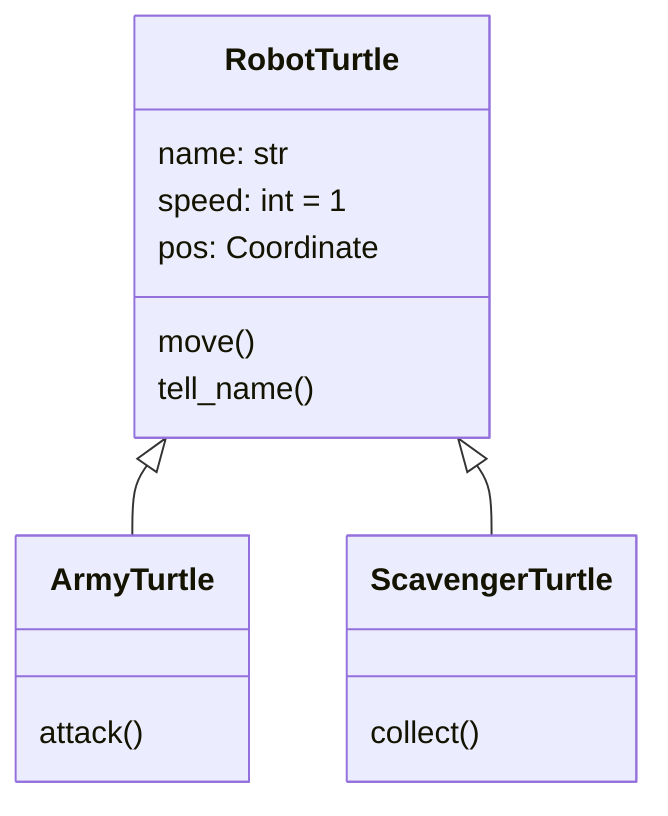
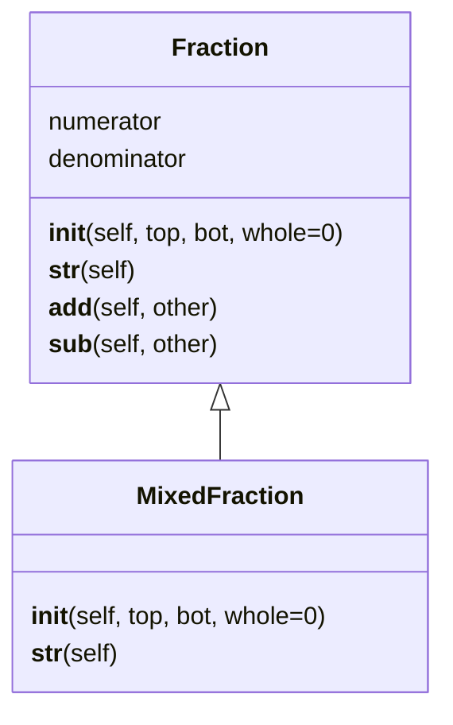
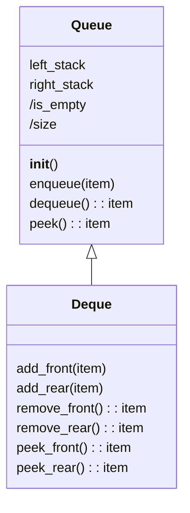

import CollapsibleAnswer from '@site/src/components/CollapsibleAnswer';
import DeepDive from '@site/src/components/DeepDive';
import ImageCard from '@site/src/components/ImageCard';
import ChatBaseBubble from "@site/src/components/ChatBaseBubble";

# Inheritance

In Python, inheritance in classes allows a child class to inherit and extend the attributes and methods of a parent class.

<ChatBaseBubble/>

### Goals

By the end of this lesson, you should be able to:

- **Apply** Stack and Queue for some applications.
- Explain `is-a` relationship for inheritance.
- Draw **UML class diagram** for `is-a` relationship.
- **Inherit** a class to create a child class from a base class.
- **Override** operators to extend parent's methods.
- Implement **Deque** data structure as a subclass of **Queue**

:::keyword Keywords
`inheritance`, `is-a relationship`, `child class`, `parent class`, `base class`, `UML class diagram`, `super`, `override`, `deque`
:::

## Inheritance

One key component of Object-Oriented Programming is Inheritance. Inheritance allows us to implement what is called as **Open-Closed** principle. The Open-Closed principle says that *a class should be open for extension but closed for modification*. 

This means that a class once it is created should not be modified. However, we may want to be able to extend that class to add new features. For example, in the earlier lesson we have the class `RobotTurtle`. This class has two methods `move()` and `tell_name()`. What if we want to create a game using `RobotTurtle` and there are various kinds of `RobotTurtle` with different capabilities. Let's say, one kind of robot turtle can attack while other kind of robot turtle can only collect items. We can name the first one as `ArmyTurtle` and the latter one as `ScavengerTurtle`. To make the game interesting, a `ScavengerTurtle` cannot attack and can only `collect()`. On the other hand, an `ArmyTurtle` can only `attack()` but cannot `collect()`. 

How can we design the class to allow these two kinds of robot turtle without modifying the `RobotTurtle` class. This is where we can use *inheritance*. 

Inheritance allows us to create a child class that inherits attributes and properties from a parent class. For example, we can create a new class called `ArmyTurtle` that has all the attributes and methods of `RobotTurtle`. Moreover, the child class can have an additional method of `attack()`. Similarly, a `ScavengerTurtle` can inherit from `RobotTurtle` and has all the attributes and methods of a `RobotTurtle`. Moreover, a `ScavengerTurtle` can have an additional method of `collect()`.

The UML diagram is shown below.



In this case, `ArmyTurtle` and `ScavengerTurtle` are child classes of `RobotTurtle`. We also call the child class as *subclass* and the parent class as *base class*.

The syntax in Python for deriving a class from some base class is as follows:

```python
class NameSubClass(NameBaseClass):
    pass
```

The name of the parent class or the base class is specified in the parenthesis after the class name. By specifying this, the child class inherits all the _attributes_ and _methods_ of the parent class. So what do we define in the child class? We can define the following things:

- attributes and methods that are unique to the child class
- methods in the parent's class that we want to override

Besides defining attributes and methods that are unique to the child class, we can also _re-define_ the methods of the parent class. This is what is called as _overriding_. For example, we can choose to modify the way the robot turtles `tell_name()` by adding its kinds whether they are the army turtle or the scavenger turtle.

Let's discuss a few more examples of inheritance.

## Fraction and MixedFraction

Let's say we have a class called `Fraction` which has two attributes: _numerator_ and _denominator_. This class also has all the methods to do the operation such as addition and subtraction. With this we can do addition and subtraction of Fraction:

```python
f1 = Fraction(1, 2)
f2 = Fraction(3, 4)
f3 = f1 + f2
f4 = f2 - f1
```

The first line creates a fraction object $1/2$ while the second line creates a fraction object $3/4$. The third line adds these two fractions $1/2 + 3/4 = 5/4$ which is then stored in `f3`. The last line, on the other hand, subtracts these two fractions, $3/4 - 1/2 = 1/4$ which is then stored in f4.

What should we do if we want to do operation with a mixed fraction such as the following?

$$
1 \frac{1}{2} + 2\frac{3}{4}
$$

Well, we can always represent these mixed fraction as two ordinary fractions

$$
\frac{3}{2} + \frac{11}{4}
$$

and perform the same fraction operations. However, we do not want to do this manipulation or conversion manually if we can just write a computer code to do so. Therefore, it is worthwhile to create a new class called `MixedFraction` where we can define a fraction that may contain a whole number and additional numerator and denominator. What is different from the `Fraction` class is the way we initialize this object. Using the example above, i.e. $1 \frac{1}{2} + 2\frac{3}{4}$, we want to be able to write in the following manner:

```python
f1 = MixedFraction(1, 2, 1)
f2 = MixedFraction(3, 4, 2)
f3 = f1 + f2
```

Note that we purposely put the whole number as the last argument because we want `MixedFraction` to be able to handle ordinary fraction when the whole number is zero.

```python
f4 = MixedFraction(1, 2) # this is the same as Fraction(1, 2)
```

The UML class diagram can be seen as shown below.



<!-- <ImageCard path={require("./images/fraction_mixedfraction.jpg").default} widthPercentage="30%"/> -->
<br/>
In the above UML diagram, we choose not to have any additional attributes but only different initialization arguments. This means that we have to initialize the numerator and the denominator from the three arguments used in the initialization `MixedFraction(top, bottom, whole)`, i.e.

$$
numerator = whole \times bottom + top
$$

Similarly, there are no methods to do addition and subtraction. The object of `MixedFraction` depends on its parent class' methods to do addition and subtraction. In fact, when Python cannot find the name of a particular method in the child class, it will try to find the same name in the parent class' methods. If no name is matched in the parent class' methods, Python will throw an error saying that such method is not defined.

Moreover, we also choose to implement `__str__()` method which is called whenever Python tries to convert the object to an `str` representation. Notice that we choose to **override** this method in the child class. The reason is that we want `Fraction` and `MixedFraction` to be represented differently as a string. For example, $5/2$ will be represented differently depending whether it is a `Fraction` object or a `MixedFraction` object.

```python
5/2   # str representation of Fraction
2 1/2 # str representation of MixedFraction
```

This is an example of how a parent class' method is overriden in the child class. The name and the argument of the method is the same and yet the behaviour is different in the child class.

Now, let's look at another example

## Queue and Deque

Another example we can work on is to extend the class `Queue` to implement a new data structure called `Deque` (pronounced as deck). The difference between a `Queue` and a `Deque` is that in `Queue` the item only has one entrance which is from the back of the Queue. The exit of a `Queue` object is at the front of the Queue. On the other hand, a `Deque` can be inserted other from the front or from the rear. Its item also can be popped out from either the front or the rear. Below is the UML representation of the class diagram when `Queue` is implemented using a double Stack.



<!-- <ImageCard path={require("./images/queue_deque.jpg").default} widthPercentage="30%"/> -->

<br/>

Notice that in the above UML class diagram, we use `/` to represent computed property, i.e. `/size` and `/is_empty`. `Deque` does not have any additional attributes or property. The only changes are the methods. We rename and add additional methods for `Deque` class. In this cass, `add_rear(item)` of `Deque` is the same as `enqueue(item)` of a `Queue` object. Similarly, `remove_front()` method of `Deque` is the same as `dequeue()` of a `Queue` object. This is also true for the case of `peek_front()` and `peek()`. Thus, we need not re-write half of the methods in `Deque` class since we can simply call its parent class' methods.

