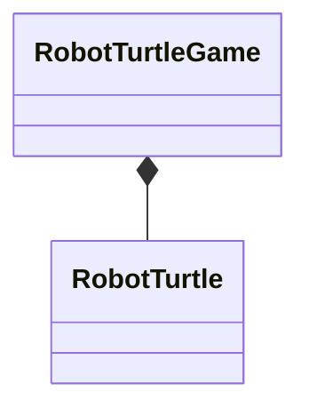
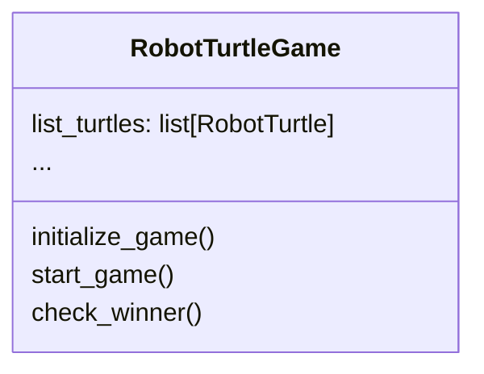

import CollapsibleAnswer from '@site/src/components/CollapsibleAnswer';
import DeepDive from '@site/src/components/DeepDive';
import ImageCard from '@site/src/components/ImageCard';
import ChatBaseBubble from "@site/src/components/ChatBaseBubble";

# Computation as Object

<ChatBaseBubble/>

Object-oriented programming is a programming paradigm that organizes code into objects, which encapsulate data and behavior, fostering modularity, reusability, and easier maintenance of software systems.

### Goals

By the end of this lesson, you should be able to:

- Use **object-oriented programming** to implement both data and **computation**.

:::keyword Keywords
`object`, `main method`, `composition` 
:::

So far we have used object to model and abstract data. For example, we created a new data called `RobotTurtle`. However, even with this usage, we see that `RobotTurtle` actually consists of two things, attributes and methods. Attributes seem like the data that we try to abstract. The methods, however, look more like computation on those data. The object `RobotTurtle` actually contains both **data** and **computation**. 

We can also actually use object to model **computation**. One common way to see this is that our *overall* code is actually a *computation*. Computation is a set of code to manipulate our data. In our example of `RobotTurtle`, this data is useless without any code that interact, manipulate, or make use of this data. We can easily imagine a computation code called `RobotTurtleSimulation` or maybe even `RobotTurtleGame` as our computation. This code actually makes use of our `RobotTurtle` data. The simulation or the game code, may spawn `RobotTurtle` objects, move it around and achieve some objectives of the game. We can see that this computation that interact with `RobotTurtle` can be conceived as another object called `RobotTurtleGame`. This game object **has** `RobotTurtle` object as its data. This is another example of **composition**. We can draw its class diagram as follows.



This class `RobotTurtleGame` may also have its attributes and methods. Every object has attributes and methods. Maybe one of its attributes is a list of `RobotTurtle` objects in the game. What can the game do? Maybe it can `initialize_game()`, `start_game()`, `check_winner()`, and so on. Again, we can represent this class using the class diagram as follows.




In your problem set, you will create both objects that represent data and computation. Some objects like `RobotTurtle` can be easily understood as another data type, while other objects like `RobotTurtleGame` can be more easily seen as computation. Anyway, every object has both data and computation. 

## Main Method

One characteristic when we represent our whole code as an object is that it usually has a **main method**. A main method is just a method of the object similar to other methods.  It is called *main* method because usually this is the method that is *invoked* to start the whole computation that the object represents. 

For example, the game using `RobotTurtle` object can be represented as an object called `RobotTurtleGame`. This object can then have a *main* method called `play()` which starts the game. As in any object, you can only use the object after it has been *instantiated*. So a common pattern that you will see is something like the code below.

```python
# instantiating the object to play the game
game: RobotTurtleGame = RobotTurtleGame()
# starting the game by calling the main method
game.play()
```

## Initializing Computation

Every computation usually requires some initialization. This sets up the initial state of the computation. In the example of the `RobotTurtleGame`, we may want to setup the `RobotTurtle` object that can be played in the game. We may want to setup the world that the `RobotTurtle` object can move around. 

There are two ways which we can initialize our computation. If the initialization is always the same, we can put this initialization in the `__init__()` method of our `RobotTurtleGame` class. For example, if the game always allow a certain number of turtles, we can instantiate this object inside the `__init__()` method as shown below.

```python
class RobotTurtleGame:
    def __init__(self) -> None:
        self.robot: RobotTurtle = RobotTurtle("turtle")
```

With the above code, a single robot is always created when we instantiate the object `RobotTurtleGame`. We can even use argument to create multiple robots during instantiation of the object.

```python
class RobotTurtleGame:
   def __init__(self, number:int=1) -> None:
        self.robots: list[RobotTurtle] = []
        for idx in range(number):
            self.robots.append(RobotTurtle("turtle" + idx)) 
```

The only consideration about this way of initialization is that this process is executed during the *instantiation* of the computation object. 

The second method of initializing computations happens when the data may be available only later after the object is instantiated. Consider for example if you have a computation class called `Calculator`. After this object is instantiated, you may still wait for the user to enter the mathematical expression that the this object is to compute. To handle this case, we can create a *method* to initialize the state of the object. For example, we can create a method called `read_input()` which takes the value the user enters into the text field of the Calculator. 

```python
class Calculator:
    ...
    def read_input(self) -> None:
        self.expression = self.get_text_input()

    def evaluate(self) -> float:
        # code to evaluate the expression
        ...
```

In this case, we can only call `evaluate()` after we call `read_input()`.

```python
calc: Calculator = Calculator()
...
calc.read_input()
calc.evaluate()
```

The method `self.read_input()` does not take any argument and it assumes that it has access to the data from another object inside `Calculator` object through `self.get_text_input()`. However, if the data comes not from within `Calculator` object, we may need to have a method that can feed in the data to initialize the attribute of the object before the computation starts. For example, we can have the method `input()` which takes in the mathematical expression as shown below.

```python
class Calculator:
    def input(self, expression: str) -> None:
        self.expression = expression
```

In this way, we use this method to initialize `expression` attribute before we evaluate it.

```python
calc: Calculator = Calculator()
calc.input("3 + 2")
print(calc.evaluate())
```

In this way, we ensure that `evaluate()` method has data before it peforms its computation. 

## Summary

In summary, we can use object to model our overall computation. Similar to any other object, this object contains data and computation. One characteristic of this object is that it usually has one main method that starts the overall computation. This method may call other methods in the process. Before calling the main method, we may need to initialize the attributes of the object to ensure that the data is there for the computation to take place. There are ways to initialize the attributes as shown in this lesson.