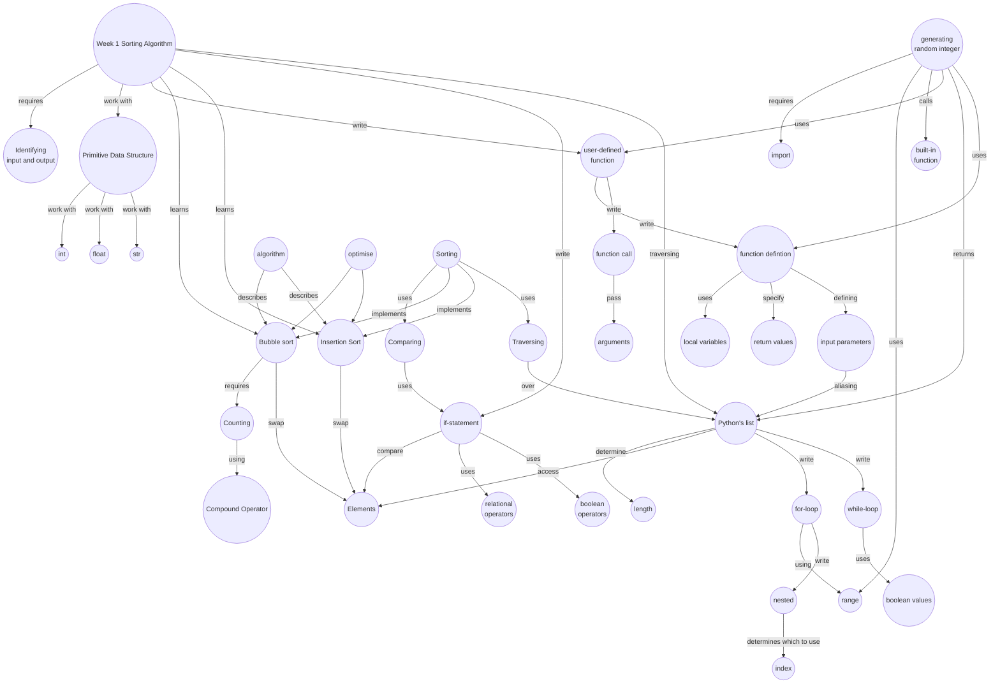

import CollapsibleAnswer from '@site/src/components/CollapsibleAnswer';
import DeepDive from '@site/src/components/DeepDive';
import ImageCard from '@site/src/components/ImageCard';
import ChatBaseBubble from "@site/src/components/ChatBaseBubble";

# Week 1: Python
<ChatBaseBubble/>

### Concept Map

<ImageCard path={require("./images/DDW Concept Map-Week 1.drawio.png").default} widthPercentage="100%"/>

